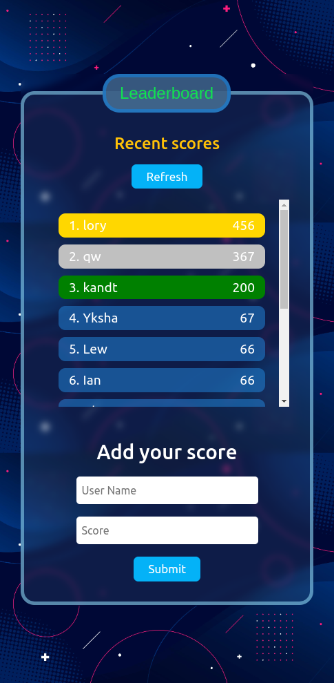

# Leaderboard

  
  

  
  

## Built With
- Javascript
- Bootstrap
- CSS
- Webpack

### Live Demo

[Demo](https://leaderboard-levy.netlify.app/)
## Getting Started

To get a local copy up and running follow these simple example steps.

### Prerequisites

A Web Browser (preferably Google Chrome)

### Setup

- Clone the GitHub Repository
- run this commands in your terminal:
     - `npm install`
     - `npm run build`
     - `npm start`

### Usage
after running `npm start` the website will be opened automatically on your default browser.

## Authors

👤 **Author1**

- GitHub: [Levy Ukwishaka](https://github.com/levy002)
- LinkedIn: [LinkedIn](https://www.linkedin.com/in/levy-ukwishaka-405391223/)
- Twitter: [Twitter](https://twitter.com/levy_ukwishaka)

## 🤝 Contributing

Contributions, issues, and feature requests are welcome!

Feel free to check the [issues page](../../issues/).

## Show your support

Give a ⭐️ if you like this project!

## Acknowledgments

- Microverse offered guidance on how to make the project more professional

## 📝 License

This project is [MIT](./MIT.md) licensed.
